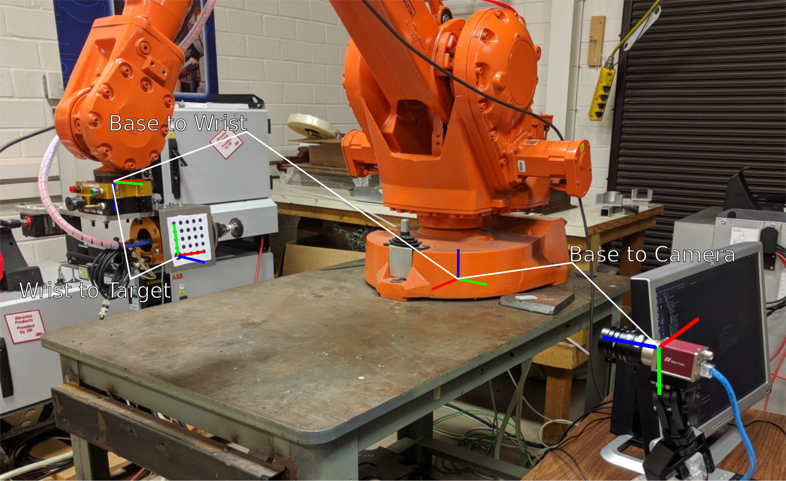

# Robot Calibration Tools

Platform               | CI Status
---------------------- |:---------
Ubuntu (Focal)         | 
Lint  (Clang-Format)   | 
Lint  (CMake-Format)   | 

## Description
A loosely connected bundle of tools for calibrating cameras to (industrial) robots and vice-versa with a focus on being easy to *integrate*  into more complex applications.

This work is based on the work of Dr. Chris Lewis @drchrislewis (see [industrial_calibration](https://github.com/ros-industrial/industrial_calibration)) and modifications made by Geoffrey Chiou in [IC2](https://github.com/geoffreychiou/IC2/). 

The focus and philosophy of this library is provide to provide a suite of stand-alone "optimization functions" that take as input structure full of well-documented arguments and produce an answer that is your calibration. How you collect data and what you do with the answer is left to you.

## Installation
This library is meant to be used within the ROS ecosystem, but the core optimizations depends on only [Ceres-Solver](http://ceres-solver.org/installation.html) and its dependencies. Follow the link for instructions to install Ceres. Afterwards, clone this package into your workspace and build with catkin.

Other support libraries use additional tools:
 - The built-in "target finder" in `rct_image_tools` uses OpenCV.
 - The data collection helpers in `rct_ros_tools` uses TF and various image transport mechanisms.

## Quick-Start
 1. Please read the [calibration primer](./cal_primer.md) for a description of terminology and conventions used in this library.
 2. Please visit the documentation for the calibration you wish to solve in `rct_optimizations`. See below for a discussion of supported problems.
 3. If you need to do intrinsic calibration of your sensor, then please use ROS' built in method from [here](http://wiki.ros.org/camera_calibration). Alternatively, use OpenCV's [calibrateCamera](https://docs.opencv.org/2.4/modules/calib3d/doc/camera_calibration_and_3d_reconstruction.html#calibratecamera) function on which the ROS utility is built.
 4. After setting up your "experiment", perform any necessary data collection: moving robots, taking images, etc. Be sure to get a good diversity of images; skew is important!
 5. Create an instance of your problem's `Problem` data structure and fill it out.
 6. Call `rct_optimizations::optimize(Problem&)` and get a `Result` back.
 7. Check that the result converged and then apply it to your workcell: either manually modify the URDF, publish the TF frame, etc. Consider using something like (shameless plug) [`mutable transform publisher`](https://github.com/Jmeyer1292/mutable_transform_publisher).

## Outline
 - `rct_optimizations`: Contains core libraries for performing the "math" of optimizations, usually using Ceres. This is where you'll find your library calls.
 - `rct_image_tools`: Builds on OpenCV to provide tools for finding targets in images. This lets you extract "correspondences" easily for supported target types.
 - `rct_examples`: This package contains both simple examples and offline processing tools for a variety of common calibrations. Look here for experimental setups and examples.
 - `rct_ros_tools`: (Experimental) Provides some "helper tools" for data collection and loading of data through ROS parameters/YAML files.

## Calibrations
See the [readme of `rct_examples`](rct_examples/README.md) for more information on the most popular and tested calibrations. There's even some nice pictures.

Currently supported calibrations:
 - Extrinsic calibration of a 2D camera on robot wrist
 - Extrinsic calibration of a 3D camera on robot wrist
 - Extrinsic calibration of one or more static cameras in the workcell

Semi-Experimental (these have testing or robustness that needs to be improved):
  - Solve PnP for one or more cameras
  - Intrinsic calibration

The source code for these calibrations can be found in `rct_optimizations`.

## Example Code
For example, see [rct_example's camera-on-wrist calibration](rct_examples/src/examples/camera_on_wrist.cpp).

## Development Plan
 1. Replicate the OpenCV intrinsic calibration
 2. Implement Qt GUI based on [IC2](https://github.com/geoffreychiou/IC2/) to speed calibration process in simple scenarios.
 3. Provide examples of qualifiying the accuracy of a calibrated system
 4. Investigate robot kinematic calibration (ala [Mike Ferguson' package](https://github.com/mikeferguson/robot_calibration))
 5. Provide tools explicitly for robot tool calibration (for the moment, please see my super simple one at [tool_point_calibration](https://github.com/Jmeyer1292/tool_point_calibration)
