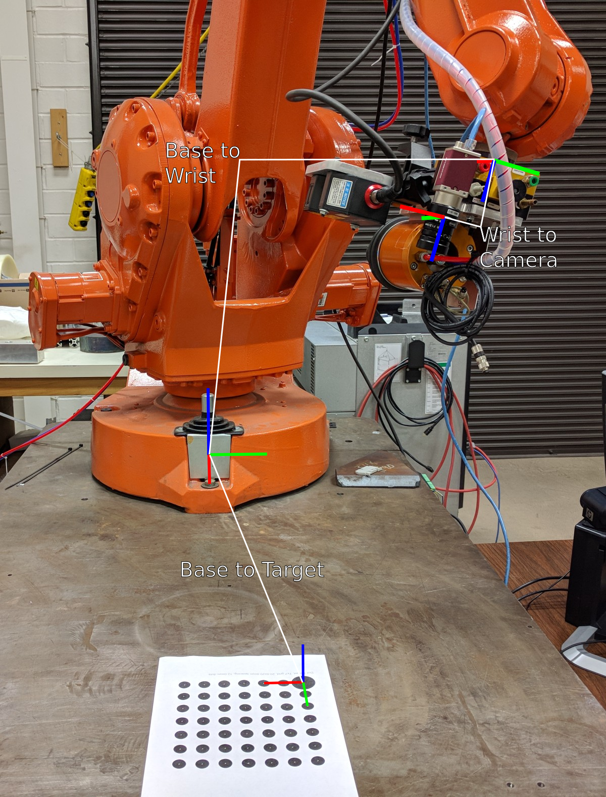

# Robot Calibration Tools Examples
## Introduction
Calibrate your camera intrinsically first. See the front page readme and calibration primer for more information.

This document describes, with pictures, the "experimental setup" for common calibrations. 

***

## Extrinsic Camera on Wrist
#### Goal
Find the transform from the robot wrist, *tool0*, to the camera.
 
#### Workcell Setup


Sorry for the paint drawings, but I hope it gets the idea across. Note the orientation of the coordinate for the target and camera. Using these, reasonable initial guesses for the calibration parameters would be:

**wrist to camera**
```
translation = [-0.2, 0, 0.2];
rotation = 
	 [0,  1,  0,
	 -1,  0,  0,
	  0,  0,  1];
``` 

Remember that you can think of the columns of the rotation matrix as the axes of the new coordinate frame in the old system. So in the above the first column `[0, -1, 0]` is the new X in the old frame, which is -Y so 0, -1, 0. The second column is the new +Y in the old frame and the third column is the new +Z in the old frame.

A guess at **base to target** would thus be:
```
translation = [1.0, 0, 0];
rotation = 
	[ 0,  1,  0
	  -1   0, 0
	  0,   0,  1];
```

#### Software Setup
For this calibration you want to:
 1. Calibrate your camera intrinsically
 2. Capture a data set of `base_to_wrist` transforms and corresponding **undistorted** images
 3. Prepare a problem definition of type `ExtrinsicCameraOnWristProblem` in header `rct_optimizations/extrinsic_camera_on_wrist.h` and call optimize.
 
 See an example of this in `rct_examples/src/camera_on_wrist_extrinsic.cpp`. Run this calibration against a test set via `roslaunch rct_examples camera_on_wrist_example.launch`.
 
 The example launch file can be run against your own test set by modifying the default arguments for target definition, camera parameters, and data source:
 
 ```
 roslaunch roslaunch rct_examples camera_on_wrist_example.launch camera_file:=<PATH_TO_YOUR_CAMERA_YAML> target_file:=<PATH_TO_YOUR_TARGET_DEF> data_path:=<PATH_TO_YOUR_DATA_INDEX_YAML>
 ```
 Look under `rct_examples/config` and `rct_examples/data` for examples of these files.
 

#### Validation
TODO

***

## Extrinsic Static Camera
#### Goal
Find the transform from the robot base frame, *base_link*, to the *camera optical frame*.
 
#### Workcell Setup


Note the orientation of the coordinate for the target and camera. Using these, reasonable initial guesses for the calibration parameters would be:

**base to camera**
```
translation = [1.5, 1.5, 0.5];
rotation = 
	[-1,  0,  0,
	  0,  0, -1,
	  0, -1,  0];
``` 

A guess at **wrist to target** would be:
```
translation = [0.25, 0.25, 0];
rotation = 
	[ 1,  0,  0
	  0   0,  1
	  0, -1,  0];
```

#### Software Setup
For this calibration you want to:
 1. Calibrate your camera intrinsically
 2. Capture a data set of `base_to_wrist` transforms and corresponding **undistorted** images
 3. Prepare a problem definition of type `ExtrinsicStaticCameraMovingTargetProblem` in header `rct_optimizations/extrinsic_static_camera.h` and call optimize.
 
 See an example of this in `rct_examples/src/static_camera_extrinsic.cpp`. You may run this calibration offline through a launch file, **but I currently have no test data sets in this repo: they were too big**. Run this calibration against a test set via `roslaunch rct_examples static_camera_example.launch`.
 
 The example launch file can be run against your own test set by modifying the default arguments for target definition, camera parameters, and data source:
 
 ```
 roslaunch roslaunch rct_examples static_camera_example.launch camera_file:=<PATH_TO_YOUR_CAMERA_YAML> target_file:=<PATH_TO_YOUR_TARGET_DEF> data_path:=<PATH_TO_YOUR_DATA_INDEX_YAML>
 ```
 Look under `rct_examples/config` and `rct_examples/data` for examples of these files.
 

#### Validation

TODO
