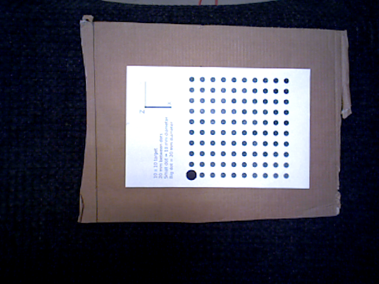
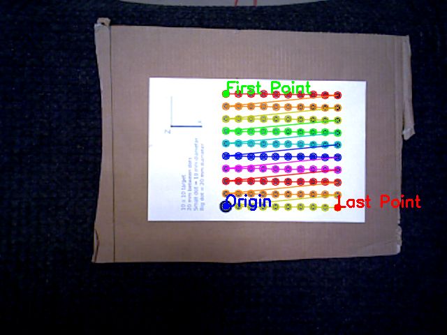

# RCT Image Tools
## Description
This package provides some support for extracting "observations" from images of targets. Nominally, we use the "modified circle grid" target. See the discussion of target
conventions in [the calibration primer](../cal_primer.md).

Jeremy Zoss wrote an awesome target creation script that can be found [here](script/calibration_target.py). See the file's docs for more information.

## Code
```c++
#include "rct_image_tools/image_observation_finder.h"
#include <opencv2/highgui.hpp>
#include <iostream>

int main(int argc, char** argv)
{
  // ...

  // Define target - constructor args are: rows, cols, point spacing
  rct_image_tools::ModifiedCircleGridTarget target (5, 7, 0.01);

  // Create a finder that works with this target
  rct_image_tools::ModifiedCircleGridObservationFinder obs_finder(target);

  // Load an image...
  cv::Mat frame = cv::imread(argv[1]);

  // Attempt to find the grid: The optional will be set if it succeeded.
  boost::optional<std::vector<Eigen::Vector2d>> maybe_obs = obs_finder.findObservations(frame);

  if (maybe_obs) // If we found it...
  {
    std::cout << "Grid observed: Found " << maybe_obs->size() << " observations!\n";
  }
  else // Otherwise we failed
  {
    std::cout << "Failed to find observations\n";
  }

  // ...
}
```
## Examples
Given this input image:



When running your calibration you should see this:



Note that the large dot is labeled as the origin and is in the bottom left corner if you were to rotate the first point to the top left.
***It is possible for this to screw up*** when points are observed from very skew angles. Make sure it looks right or you will have bad
convergence.

